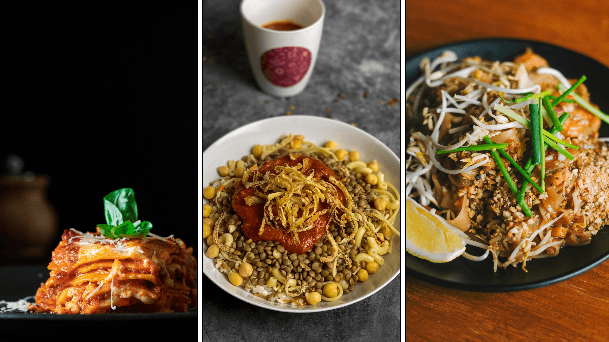

# Odin Recipes

A basic recipe website, and my first project with [The Odin Project](https://theodinproject.com).

The website consists of a main index page containing links to multiple pages, each for a different recipe.

_Odin Recipes_ was created as a practice on [HTML](https://www.theodinproject.com/paths/foundations/courses/foundations#html-foundations) and [CSS](https://www.theodinproject.com/paths/foundations/courses/foundations#css-foundations) foundations, thus it looks basic and does not necessarily follow best practices regarding code, design, accessibility, etc. I have written a [list of the concepts and skills I have practiced coding this project](#concepts-and-skills-practiced)

## Viewing the site

You can [view the project on GitHub Pages](https://alikamel-dev.github.io/odin-recipes)

> [!NOTE]
> This is my first web development project, created as a practice on HTML and CSS foundations, so until I revisit the project it will look basic and will not follow many best practices regarding code, design, accessibility, etc.

## Concepts and skills practiced

- HTML
  - Creating correctly structured markup with basic boilerplate.
  - Correct use of basic HTML elements (headings, paragraphs, lists, links and images), including the correct use of ordered and unordered lists.

  Details regarding the markup are provided in the [markup structure](#markup-structure) section.

- CSS
  - CSS basics: basic syntax, basic selectors and properties, compound selectors, the cascade, specificity, and inheritance.
  - CSS box model and related properties, block and inline display modes.

- Inspecting markup and styles using the built-in developer tools of web browsers.

- Git: Create a new repository on GitHub, Clone a GitHub repository, Commit early and often with well-written commit messages.

## Project structure

The website consists of a main [**_index page_**](https://github.com/alikamel-dev/odin-recipes/blob/main/index.html) (home page), containing links to all of the **_recipe pages_** of the website (under [`/recipes`](https://github.com/alikamel-dev/odin-recipes/tree/main/recipes)), each of which contains two links back to the index page at the top and the bottom of the page to allow users to quickly return to the homepage if they decide they do not want to read the recipe or if they have finished reading it.

Each recipe page contains an image of the recipe, a description, the ingredients and the steps of preparation.

The following subsections explain the markup structure and the sources of the material in deeper detail.

### Markup structure

This section explains the structure of and the HTML elements used in each of the index and recipe pages.

HTML element name-tag pairs link to the MDN Web Docs HTML Reference page for the respective elements.

> [!NOTE]
> The purpose of this section is to document the semantics I used to represent each part of the website, hence elements with no semantics that are intended for styling purposes, such as [content divisions `
`](https://developer.mozilla.org/en-US/docs/Web/HTML/Reference/Elements/div) and [content spans ``](https://developer.mozilla.org/en-US/docs/Web/HTML/Reference/Elements/span), will be ignored.

#### Index page

1. A [level 1 section heading (`<h1>`)](https://developer.mozilla.org/en-US/docs/Web/HTML/Reference/Elements/Heading_Elements) for the name of the website

2. Two [paragraphs (`
`)](https://developer.mozilla.org/en-US/docs/Web/HTML/Reference/Elements/p) for introductory text (**not required by the project assignment**)

3. An [unordered list (`<ul>`)](https://developer.mozilla.org/en-US/docs/Web/HTML/Reference/Elements/ul) of [anchors (`a`)](https://developer.mozilla.org/en-US/docs/Web/HTML/Reference/Elements/a) of links to recipe pages, preceded by a [level 2 section heading (`<h2>`)](https://developer.mozilla.org/en-US/docs/Web/HTML/Reference/Elements/Heading_Elements) for the title of the list (**the title of the list is not required by the project assignment**)

> [!NOTE]
> All links to recipe pages open in the same tab, which is more convenient especially given that each recipe page contains two links to the index page at the top and the bottom.

#### Recipe pages

1. A [level 1 section heading (`<h1>`)](https://developer.mozilla.org/en-US/docs/Web/HTML/Reference/Elements/Heading_Elements) for the name of the recipe

2. An [image embed (``)](https://developer.mozilla.org/en-US/docs/Web/HTML/Reference/Elements/img) for the image of the recipe

3. Three [level 2 section headings (`<h2>`)](https://developer.mozilla.org/en-US/docs/Web/HTML/Reference/Elements/Heading_Elements) for the three section titles: description, ingredients and steps.
   1. The _description_ section contains one or more [paragraphs `
`](https://developer.mozilla.org/en-US/docs/Web/HTML/Reference/Elements/p) giving general introductory information about the recipe. Although **not required by the project assignment**, the description may include multiple names the recipe is known by, each represented by a [definition `<dfn>`](https://developer.mozilla.org/en-US/docs/Web/HTML/Reference/Elements/dfn).

   2. The _ingredients_ section contains an [unordered list (`<ul>`)](https://developer.mozilla.org/en-US/docs/Web/HTML/Reference/Elements/ul) of ingredients.

      > [!NOTE]
      > Fractions are represented using [HTML character references](https://developer.mozilla.org/en-US/docs/Glossary/Character_reference) (more commonly referred to as _HTML character entities_ or simply _HTML entities_). This is **not required by the project assignment**.

   3. The _steps_ section contains an [ordered list (`<ol>`)](https://developer.mozilla.org/en-US/docs/Web/HTML/Reference/Elements/ul) of preparation steps.

4. Two links to the index page, one at the top and one at the bottom of the page to allow quick return to the homepage.

   The project assignment requires only one of the two links, but I believe that including both is better, where the top link allows quick return in case the user has unintentionally opened a page for a recipe they did not want (or: the user looked at the image and/or the description of the recipe and decided they do not want to continue reading), and the bottom link allows quick return after the user has finished reading the recipe.

### Resources

The project assignment requires exactly three recipe pages, leaving the choice of recipes to the developer and providing [Allrecipes](https://allrecipes.com), as a source if needed.

- Recipe descriptions were adapted from the [English wikipedia](https://en.wikipedia.org), while ingredients and steps were taken from Allrecipes.
- Recipe images were taken from [Unsplash](https://unsplash.com) and [Pexels](https://pexels.com).

The following table lists the recipes chosen and their respective Wikipedia articles and Allrecipes recipe pages from which the information for _Odin Recipes_ were obtained.

| Recipe   | Wikipedia article                                           | Allrecipes recipe page                                                            |
|----------|-------------------------------------------------------------|-----------------------------------------------------------------------------------|
| Lasagna  | [Wikipedia article](https://en.wikipedia.org/wiki/Lasagna)  | [_World's Best Lasagna_](https://allrecipes.com/recipe/23600/worlds-best-lasagna) |
| Koshari  | [Wikipedia article](https://en.wikipedia.org/wiki/Koshary)  | [_Egyptian Koshari_](https://allrecipes.com/recipe/159456/egyptian-koshari)       |
| Pad Thai | [Wikipedia article](https://en.wikipedia.org/wiki/Pad_thai) | [_Pad Thai_](https://allrecipes.com/recipe/42968/pad-thai)                        |

## Other projects

Feel free to view my other projects on [my website](https://alikamel-dev.github.io/homepage).